# Microservicios de ejemplo: Products + Users

**Contexto académico:** Este proyecto es un laboratorio práctico para la especialidad **Fullstack 3 - Ingeniería de Software** (DUOC).
Ilustra cómo pasar de desarrollo local → containerización → orquestación de microservicios en Kubernetes.

**Contenido:**
- `products-java`: Spring Boot + Gradle, puerto `4020` (backend Java)
- `users-nodejs`: Express.js, puerto `4021` (backend Node.js)

**Características:**
- Ambos servicios responden con datos mock (sin base de datos externa)
- `users-nodejs` persiste usuarios en archivo JSON (`data/data.json`) — ejemplo de persistencia local
- Arquitectura diseñada para mostrar cómo dos microservicios independientes se comunican y se orquestan

**Fases del laboratorio:**
Veras cómo evolucionan estos servicios: 1️⃣ manual local → 2️⃣ Docker individualizado → 3️⃣ Docker Compose → 4️⃣ Kubernetes → 5️⃣ API Gateway + Frontend → 6️⃣ Auth Platform

## 📋 Indice de contenidos

0. [Configuración Windows](#0-configuracion-en-windows-git-bash--docker-desktop) ← **Si usas Windows, lee primero**
1. [Ejecución manual (local)](#1-ejecutar-de-forma-manual-sin-docker) ← **Comienza aquí si es tu primera vez**
2. [Docker Dockerfiles](#2-ejecutar-usando-dockerfiles-sin-compose)
3. [Docker Compose](#3-ejecutar-con-docker-compose)
4. [Kubernetes](#4-base-para-kubernetes-siguiente-paso)
5. [API Gateway + Frontend React](#5-api-gateway--frontend-react-e2e-completo)
6. [Auth Service (JWT + PostgreSQL)](#6-auth-service-jwt--postgresql)
7. [Cart Service (FastAPI + inter-microservicio)](#7-cart-service-fastapipython--comunicación-inter-microservicio) ← **Fase final del laboratorio**

---

## 0) Configuracion en Windows (Git Bash + Docker Desktop)

Esta guia esta escrita originalmente para macOS/Linux. Si usas Windows, lee esta seccion
antes de continuar: la mayoria de los comandos funcionan igual en Git Bash, con algunas
diferencias puntuales que se detallan aqui y se repiten en cada seccion donde apliquen.

### Herramientas necesarias en Windows

- **Git for Windows** (incluye Git Bash): disponible en https://git-scm.com/downloads
  Durante la instalacion, seleccionar "Git Bash Here" como opcion de menu contextual.
- **Java 25**: instalador `.msi` disponible en https://adoptium.net
- **Node.js 20+**: instalador `.msi` disponible en https://nodejs.org
- **Docker Desktop**: ya instalado (incluye Kubernetes integrado para el laboratorio).

Todos los comandos de esta guia deben ejecutarse desde **Git Bash**, no desde PowerShell ni
desde CMD, salvo que se indique explicitamente lo contrario.

### Habilitar Kubernetes en Docker Desktop

Docker Desktop incluye un cluster Kubernetes local que funciona perfectamente para este laboratorio.

1. Abrir Docker Desktop → Settings → Kubernetes.
2. Marcar la casilla **Enable Kubernetes** si no esta habilitado.
3. Esperar a que el cluster inicie (status icon verde abajo a la derecha).
4. Verificar desde Git Bash que funciona:

```bash
kubectl config current-context
kubectl cluster-info
```

La salida de `current-context` debe ser `docker-desktop`. Con esto, `docker` y `kubectl` usan
el mismo entorno: las imagenes que construyes con `docker build` son automaticamente visibles
para el cluster sin necesidad de registry remoto.

### Diferencias de comandos en Git Bash respecto a macOS/Linux

**1. Bind mounts en docker run (volumenes con rutas absolutas):**

Git Bash en Windows puede convertir automaticamente las rutas POSIX a rutas Windows, lo que
rompe el montaje del volumen en Docker. Para evitarlo, agrega `MSYS_NO_PATHCONV=1` antes del
comando docker run que usa `-v`:

macOS/Linux:
```bash
docker run -d --name users-nodejs -p 4021:4021 \
  -v $(pwd)/users-nodejs/data/data.json:/app/data/data.json \
  users-nodejs:1.0
```

Windows (Git Bash):
```bash
MSYS_NO_PATHCONV=1 docker run -d --name users-nodejs -p 4021:4021 \
  -v $(pwd)/users-nodejs/data/data.json:/app/data/data.json \
  users-nodejs:1.0
```

- `MSYS_NO_PATHCONV=1`: desactiva la conversion automatica de rutas de Git Bash para ese comando.
- El resto del comando es identico.

**2. Agregar entrada al archivo hosts:**

En Windows el archivo equivalente a `/etc/hosts` esta en
`C:\Windows\System32\drivers\etc\hosts` y no existe `sudo`. Se requiere PowerShell
ejecutado como Administrador:

macOS/Linux:
```bash
echo "127.0.0.1 micro.local" | sudo tee -a /etc/hosts
```

Windows (PowerShell como Administrador):
```powershell
Add-Content -Path "C:\Windows\System32\drivers\etc\hosts" -Value "127.0.0.1 micro.local"
```

O manualmente: clic derecho en Notepad → "Ejecutar como administrador" → Archivo → Abrir
→ navegar a `C:\Windows\System32\drivers\etc\hosts` → agregar `127.0.0.1 micro.local`
al final → guardar.

**3. Eliminar entrada del archivo hosts al FINALIZAR el laboratorio (limpieza completa):**

⚠️ **IMPORTANTE**: No ejecutes este comando mientras estes usando el cluster de Kubernetes.
Este comando BORRA la entrada `127.0.0.1 micro.local` del archivo hosts.
Solo ejecuta esto cuando hayas terminado completamente con el laboratorio.

macOS/Linux:
```bash
sudo sed -i '' '/micro\.local/d' /etc/hosts
```

Explicacion:
- `sudo sed -i '' '/micro\.local/d' /etc/hosts`: elimina permanentemente la linea que contiene `micro.local`.
- `-i ''`: edita el archivo en su lugar (requerido en macOS).
- `'/micro\.local/d'`: patrón de busqueda + accion de borrado (`d` = delete).
- Despues de esto, `micro.local` ya no sera resuelto a `127.0.0.1`.

Windows (PowerShell como Administrador):
```powershell
(Get-Content "C:\Windows\System32\drivers\etc\hosts") |
  Where-Object { $_ -notmatch 'micro\.local' } |
  Set-Content "C:\Windows\System32\drivers\etc\hosts"
```

Explicacion:
- Lee todas las lineas de `hosts`, filtra las que NO contengan `micro.local` y reescribe el archivo.
- `Where-Object { $_ -notmatch ... }`: conserva solo las lineas que NO coinciden con el patron.
- Resultado: `127.0.0.1 micro.local` es eliminada permanentemente.

El resto de los comandos (`./gradlew`, `docker build`, `docker compose`, `kubectl`, `curl`)
funcionan igual en Git Bash sin ninguna modificacion.

## 1) Ejecutar de forma manual (sin Docker)

**Objetivo:** Levantar ambos microservicios en tu máquina local sin contenedores.
**Por qué empezar aquí:** Entiender qué hace cada servicio en aislamiento antes de containerizarlos.

### Requisitos

- Java 25 (instalado y en PATH)
- Node.js 20+ con npm (instalado y en PATH)

**Nota técnica:** En `products-java` se usa **Gradle Wrapper** (`./gradlew`), una herramienta que descarga la versión correcta de Gradle automáticamente. Esto evita conflictos de versiones y no requiere Gradle instalado globalmente — es una best practice en Java.

### 1.1 Levantar products-java (Spring Boot + Gradle)

Desde la raíz del proyecto:

```bash
cd products-java
./gradlew bootRun
```

Endpoints:

- `GET http://localhost:4020/api/products`
- `GET http://localhost:4020/api/products/{id}`

### 1.2 Levantar users-nodejs (Express)

En otra terminal, desde la raíz del proyecto:

```bash
cd users-nodejs
npm install
npm start
```

Endpoints:

- `GET http://localhost:4021/api/users`
- `GET http://localhost:4021/api/users/{id}`
- `POST http://localhost:4021/api/users`

Ejemplo body para crear usuario:

```json
{
  "name": "Maria Lopez",
  "email": "maria.lopez@duocuc.cl",
  "role": "student"
}
```

## 2) Ejecutar usando Dockerfiles (sin Compose)

**Objetivo:** Containerizar cada microservicio individuamente con Docker.
**Concepto clave:** Cada Dockerfile define cómo empaquetar una aplicación en una imagen reutilizable.
**Por qué este paso:** Antes de orquestar con Compose, necesitas entender cómo crear y ejecutar contenedores.

Desde la raíz `microservicios`:

### 2.1 Build de imágenes

```bash
docker build -t products-java:1.0 ./products-java
docker build -t users-nodejs:1.0 ./users-nodejs
```

Atajo recomendado (ambas imagenes en un solo comando):

```bash
./scripts/build-images.sh
```

Este script construye siempre las imagenes locales con tag fijo `1.0`:

- `products-java:1.0`
- `users-nodejs:1.0`

Explicacion de cada linea:

- `docker build -t products-java:1.0 ./products-java`: construye la imagen de Java usando el Dockerfile dentro de `products-java` y la etiqueta como `products-java:1.0`.
- `docker build -t users-nodejs:1.0 ./users-nodejs`: construye la imagen de Node.js usando el Dockerfile dentro de `users-nodejs` y la etiqueta como `users-nodejs:1.0`.

### 2.2 Levantar contenedores

```bash
docker run -d --name products-java -p 4020:4020 products-java:1.0
```

Explicacion del comando anterior:

- `docker run`: crea y ejecuta un contenedor nuevo.
- `-d`: lo deja corriendo en segundo plano.
- `--name products-java`: nombre fijo para administrarlo facil.
- `-p 4020:4020`: publica el puerto del contenedor en tu maquina.
- `products-java:1.0`: imagen que se ejecuta.

Para users con volumen al archivo JSON:

```bash
docker run -d --name users-nodejs -p 4021:4021 \
  -v $(pwd)/users-nodejs/data/data.json:/app/data/data.json \
  users-nodejs:1.0
```

Explicacion del comando anterior:

- `docker run`: crea y ejecuta un contenedor nuevo.
- `-d`: lo deja corriendo en segundo plano (detached mode).
- `--name users-nodejs`: nombre fijo del contenedor para administrarlo facil.
- `-p 4021:4021`: publica el puerto `4021` del contenedor en el puerto `4021` de tu maquina.
- `-v $(pwd)/users-nodejs/data/data.json:/app/data/data.json`: **bind mount** — vincula el archivo del
  host directamente con el archivo del contenedor. NO es un enlace simbólico; es una conexion directa
  a nivel del kernel: son el MISMO archivo físico accesible desde dos rutas distintas.
  - `$(pwd)/users-nodejs/data/data.json`: ruta del archivo en tu máquina (host).
  - `:/app/data/data.json`: ruta donde el contenedor ve el mismo archivo.
  - Cuando el contenedor escribe en `/app/data/data.json`, los cambios se guardan en el host en
    `data/data.json` y viceversa.
  - **Persistencia**: aunque eliminemos el contenedor con `docker rm`, el archivo del host permanece
    intacto con todos los datos. El contenedor es efímero; el archivo en el host es permanente.
  - **Flujo de datos**: host → [kernel] ← contenedor. Ambos lados leen/escriben en el mismo lugar.
- `users-nodejs:1.0`: imagen que se utiliza para crear el contenedor.
- `\`: solo permite partir el comando en varias lineas para que sea mas legible.

En Windows (Git Bash), agrega `MSYS_NO_PATHCONV=1` al inicio para evitar que Git Bash
convierta la ruta del volumen (ver seccion 0 para detalle):

```bash
MSYS_NO_PATHCONV=1 docker run -d --name users-nodejs -p 4021:4021 \
  -v $(pwd)/users-nodejs/data/data.json:/app/data/data.json \
  users-nodejs:1.0
```

**Diagrama del bind mount (persistencia de datos):**

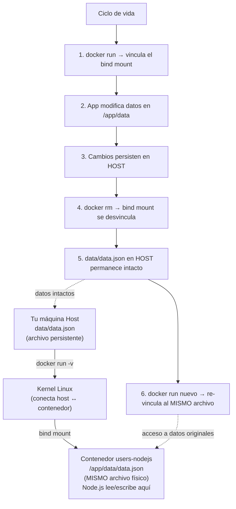

### 2.3 Probar endpoints

```bash
curl http://localhost:4020/api/products
curl http://localhost:4021/api/users
```

## 3) Ejecutar con Docker Compose

**Objetivo:** Lanzar múltiples contenedores (products + users) con networking configurado automáticamente.
**Concepto clave:** Compose es un orquestador local para desarrollo; define el estado deseado en `docker-compose.yml`.
**Por qué este paso:** Simula lo que harás en Kubernetes, pero en tu máquina local de forma rápida.

Desde la raíz `microservicios`:

```bash
docker compose up --build -d
```

Explicacion:

- `docker compose`: levanta varios servicios definidos en `docker-compose.yml`.
- `up`: crea y arranca los servicios.
- `--build`: reconstruye imagenes antes de levantar.
- `-d`: deja los servicios corriendo en segundo plano.

Ver logs:

```bash
docker compose logs -f
```

Explicacion:

- `logs`: muestra logs de todos los servicios del compose.
- `-f`: sigue los logs en tiempo real.

Detener:

```bash
docker compose down
```

Explicacion:

- `down`: detiene y elimina contenedores y red del compose.

Servicios publicados:

- `products-java` en `http://localhost:4020`
- `users-nodejs` en `http://localhost:4021`

Importante sobre Docker Compose:

- Docker Compose es principalmente para desarrollo, pruebas locales y demos de integracion.
- En entornos productivos normalmente se usa Kubernetes, no Compose.
- Compose sigue siendo muy util para validar rapido en tu computador antes de pasar a Kubernetes.

Comparacion rapida:

- Docker Compose: ideal para trabajar en local con varios contenedores, rapido de levantar y facil de depurar.
- Kubernetes: ideal para ambientes mas reales o productivos, con auto-restart, escalado y declaracion de estado.
- Con Kubernetes, no necesitas docker-compose para ejecutar los servicios del cluster.
- En este proyecto, Compose queda como etapa de laboratorio local previa al despliegue Kubernetes.

## 3.1) Limpieza Docker (dejar todo desde cero)

Desde la raiz `microservicios`, para borrar lo creado por este proyecto:

```bash
docker compose down --rmi local --volumes --remove-orphans
docker rm -f products-java users-nodejs 2>/dev/null || true
docker rmi -f products-java:1.0 users-nodejs:1.0 2>/dev/null || true
docker volume prune -f
docker network prune -f
```

Explicacion de cada linea:

- `docker compose down --rmi local --volumes --remove-orphans`: detiene y borra recursos del compose, elimina imagenes locales generadas por compose, elimina volumenes declarados y contenedores huerfanos.
- `docker rm -f products-java users-nodejs 2>/dev/null || true`: fuerza el borrado de esos contenedores por nombre; si no existen, no rompe el flujo.
- `docker rmi -f products-java:1.0 users-nodejs:1.0 2>/dev/null || true`: elimina las imagenes etiquetadas del proyecto; si no existen, continua sin error.
- `docker volume prune -f`: borra volumenes Docker no usados por contenedores.
- `docker network prune -f`: borra redes Docker no usadas.

Para limpieza total de Docker en tu maquina (cuidado: elimina TODO lo no usado globalmente):

```bash
docker system prune -a --volumes -f
```

Explicacion:

- `docker system prune`: limpia recursos Docker no usados.
- `-a`: incluye imagenes no usadas (no solo dangling).
- `--volumes`: incluye volumenes no usados.
- `-f`: ejecuta sin pedir confirmacion.

## 4) Kubernetes: orquestación a nivel producción

**Objetivo:** Desplegar los microservicios en Kubernetes (k8s), aprendiendo conceptos fundamentales de orquestación.
**Contexto:** Docker Compose es útil para desarrollo local. Kubernetes es lo que usan empresas para producción.
**Qué aprenderás:** Namespaces, Deployments, Services, PersistentVolumes, Ingress y Traefik.

### Base para Kubernetes (siguiente paso)

Archivos de Kubernetes usados en esta guia:

- `k8s/namespace.yaml`
- `k8s/ingress-traefik.yaml`
- `products-java/k8s/deployment.yaml`
- `users-nodejs/k8s/pvc.yaml`
- `users-nodejs/k8s/deployment.yaml`

Finalidad de cada archivo:

- `k8s/namespace.yaml`: crea el namespace `microservicios` para aislar todos los recursos del laboratorio.
- `k8s/ingress-traefik.yaml`: define reglas HTTP de entrada para publicar ambos microservicios por host/path usando Traefik.
- `products-java/k8s/deployment.yaml`: define Deployment + Service de `products-java`.
- `users-nodejs/k8s/pvc.yaml`: solicita almacenamiento persistente para los datos de usuarios.
- `users-nodejs/k8s/deployment.yaml`: define Deployment + Service de `users-nodejs` y monta el PVC en `/app/data`.

---

## ❓ Por qué Deployment y Service son **cosas diferentes** (y por qué ambas existen)

Esta es una pregunta frecuente:

> "Si ambos están en el mismo archivo `deployment.yaml`, ¿por qué no son lo mismo?"

### La analogía del Restaurante 🍕

Imagina que tienes un restaurante:

- **Deployment**: Es la "Cocina"
  - Quién: chef + cocineros
  - Qué hace: prepara la comida
  - Responsabilidades: receta, cantidad, calidad, si alguien se enferma → reemplaza al cocinero
  - Mantra: "Tengo 1 chef, si se enferma levanto otro. Total siempre 1 cocinando"

- **Service**: Es el "Mostrador"
  - Quién: una persona en el mostrador
  - Qué hace: toma órdenes + entrega comida
  - Responsabilidades: estar en un lugar fijo, tomar pedidos, coordinar con la cocina
  - Mantra: "Los clientes siempre encuentran el mostrador en el mismo lugar"

**Si el chef se enferma:**
- ❌ El chef sale de la cocina (fracaso del Deployment)
- ✅ Kubernetes levanta otro chef INMEDIATAMENTE
- ✅ El mostrador sigue en el mismo lugar (el Service NO cambió)
- ✅ Los clientes NO notaron nada

**¿Qué pasa si mezclas Cocina + Mostrador en uno?**

Si el chef se enferma → **cierra el mostrador también**. Los clientes no pueden hacer nada.

### En Kubernetes: Deployment vs Service

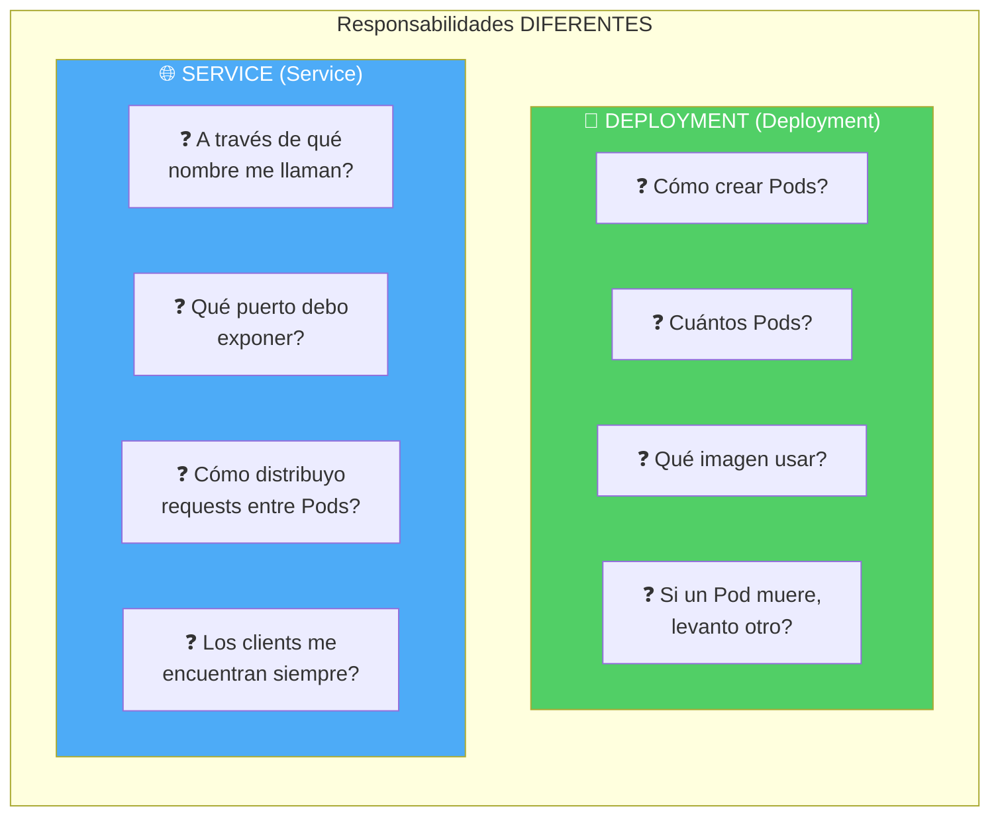

**Tabla comparativa:**

| Aspecto | Deployment | Service |
|---------|-----------|---------|
| **¿Qué es?** | Receta para crear/mantener Pods | Punto de acceso estable a los Pods |
| **Responsabilidad** | Gestión de Pods (crear, replicar, actualizar) | Networking (cómo acceder a Pods) |
| **Si falla** | Levanta nuevo Pod automáticamente | Sigue funcionando, pero sin Pods donde ir |
| **Ciclo de vida** | Pods vienen y van (IPs cambian) | Name/IP Service permanece estable |
| **Cambio en código?** | Actualiza/redeploy necesario | Sin cambios |
| **Cambio puerto?** | Redeploy necesario | Solo actualizar Service |
| **Ejemplo** | `deployment.yaml` | `deployment.yaml` (mismo archivo) |

### En tu proyecto: ¿Cómo funciona?

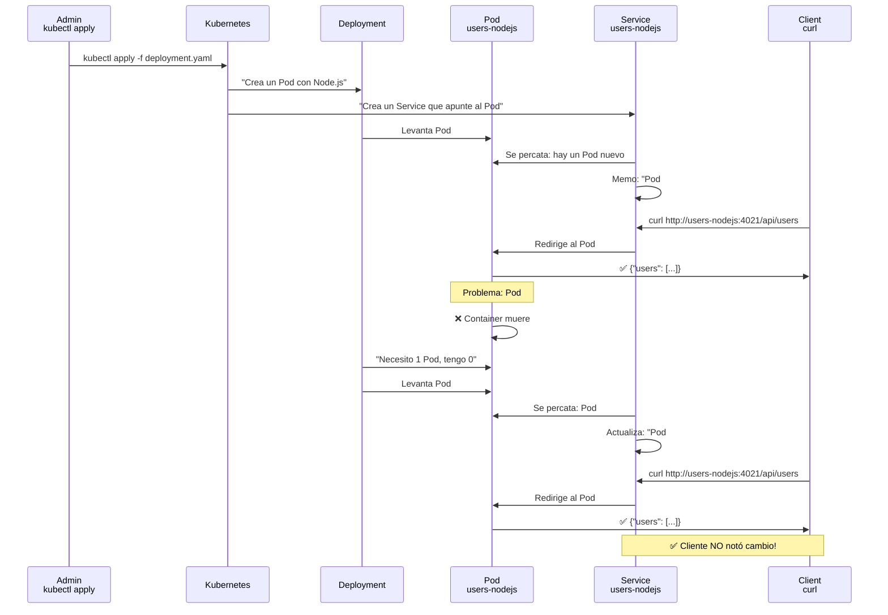

**¿Por qué son separados?**

1. **Separation of Concerns** (Separación de responsabilidades)
   - Deployment = "¿Existe el servicio?" (crear/eliminar Pods)
   - Service = "¿Dónde está el servicio?" (encontrarlo consistentemente)

2. **Flexibilidad**
   - Puedes tener 1 Service apuntando a múltiples Deployments
   - Puedes cambiar la imagen del Deployment sin que el Service cambie

3. **Descubrimiento automático**
   - Service es DNS interno: `usuarios-nodejs` siempre es NAME
   - Deployment es solo la receta: puede cambiar

### Autoevaluación sugerida

Considera este escenario:

> **Escenario:** Cambias el código de Node.js, recompiles la imagen (`users-nodejs:2.0`), y haces `kubectl apply -f deployment.yaml` nuevamente. El Deployment levanta un nuevo Pod con la nueva imagen.
>
> **Pregunta:** ¿Necesita el cliente cambiar la URL para conectarse?
> - (A) Sí, porque la IP del Pod cambió
> - (B) Sí, porque el puerto cambió  
> - (C) No, porque el Service sigue teniendo el mismo nombre
> - **(D) No, porque Kubernetes mapea "usuarios-nodejs" automáticamente**
>
> **Respuesta correcta:** (C) y (D) - El Service actúa como intermediario estable.

---

**¿Qué es un PVC y cómo funciona la "portabilidad"?**

- **PVC** = `PersistentVolumeClaim` — una solicitud de almacenamiento persistente en Kubernetes.
- **Por qué importa:** Los Pods (contenedores) son efímeros. Cuando se reinician, pierden datos en memoria. El PVC los preserva.

**Diferencia crítica: Bind mount vs PVC**

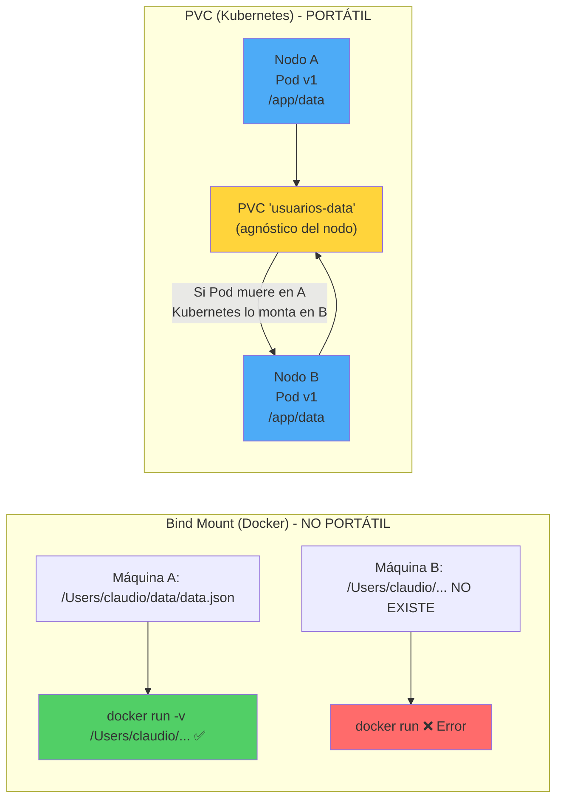

**¿Cómo funciona realmente? (El mecanismo)**

Cuando creas un PVC, Kubernetes **no lo entierra en una máquina**. Lo registra en un "registro central":

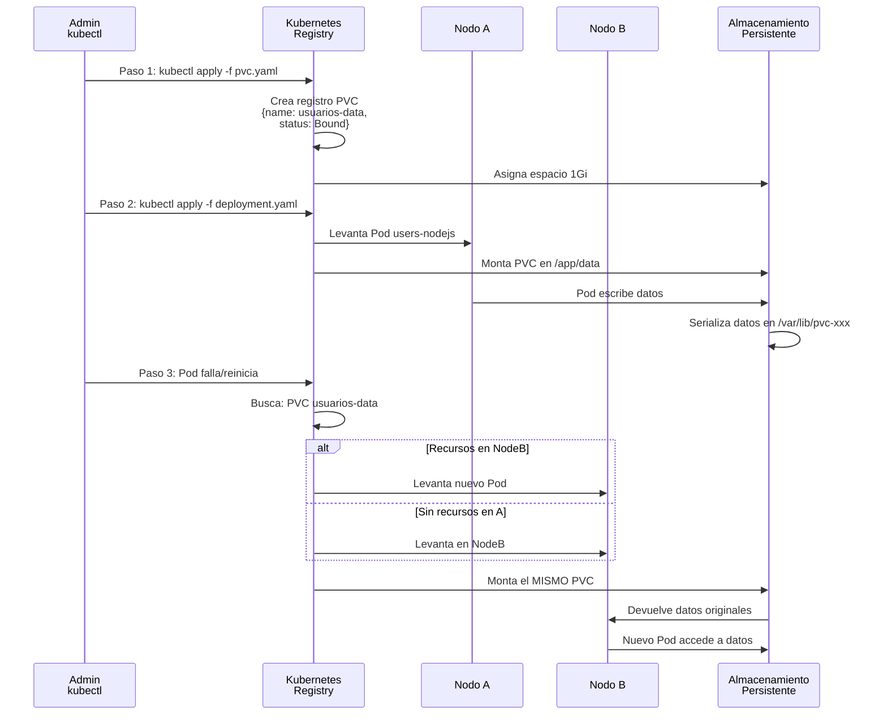

**Analogía final: PVC es como una cuenta bancaria**

Bind mount (USB que llevas contigo):
```
Llevas $100 en una billetera (en tu máquina)
Si cambias de país → dinero en moneda distinta, no puedes usar
Si pierdes la billetera → pierdes todo
Solo funciona EN ESTA MÁQUINA
```

PVC (Cuenta bancaria en varios bancos):
```
Tienes $100 en una "cuenta usuarios-data"
El banco (Kubernetes) tiene la referencia:
  "nombre_cuenta": "usuarios-data",
  "saldo": 100,
  "donde_guardar": "/var/lib/..."

Vas a sucursal Nodo A → el banco te da acceso a $100
Sucursal Nodo A cierra (Pod muere)
Vas a sucursal Nodo B → el banco SIGUE ENCONTRANDO tu cuenta
Retiras: todavía hay $100 (los mismos)

❌ El dinero NO se copió
✅ El dinero es el MISMO en cualquier ubicación
✅ El banco decidió EN CUÁL SUCURSAL GUARDAR (no tú)
```

### 📚 Autoevaluación: **Datos que viajan entre Pods**

Después de entender Deployment, Service y PVC, revisa esta pregunta:

> **Escenario:** Tu Pod A (en Node A) escribe datos en `/app/data` usando el PVC. Luego, el Pod falla y Kubernetes levanta un Pod B (potencialmente en Node B diferente).
> 
> **Pregunta:** ¿Qué ve el Pod B cuando accede a `/app/data`?
> - (A) Nada, porque Node B es una máquina diferente  
> - (B) Los datos ORIGINALES que escribió Pod A
> - (C) Una copia del archivo de Node A
> - (D) Un error porque la ruta `/app/data` no existe en Node B

**Respuesta correcta: (B) Los datos ORIGINALES**

**Explicación:**

- ❌ No es (A): El PVC NO es un disco local de Node A
- ✅ Es (B): El PVC almacena datos en almacenamiento compartido (agnóstico del nodo)
- ❌ No es (C): Los datos NO se copian; son los MISMOS datos
- ❌ No es (D): El PVC se monta automáticamente en Node B en la misma ruta

**Visualización en Docker Desktop (1 solo nodo):**

Aunque solo tengas 1 nodo, el mecanismo es idéntico:

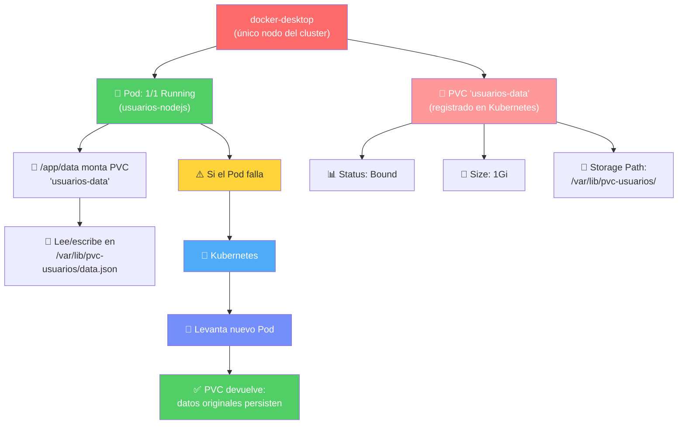

---

## 🎯 La jerarquía de Kubernetes: "Matroshka" de contenedores

Antes de empezar, necesitas entender cómo se relacionan los elementos de Kubernetes. No es exactamente una matroshka lineal (uno dentro de otro), sino una **estructura anidada con algunos elementos coexistiendo horizontalmente**:

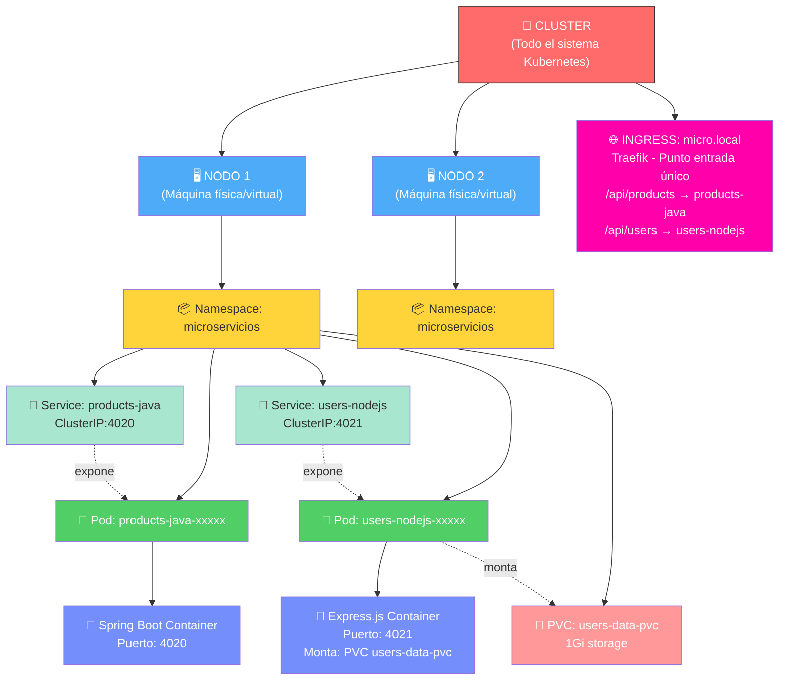

**La jerarquía explicada de adentro hacia afuera:**

1️⃣ **Contenedor** (nivel más específico)
   - Es tu aplicación ejecutándose (Spring Boot, Express.js, etc.)
   - Puertos específicos: 4020, 4021
   - Imagen Docker: `products-java:1.0`, `users-nodejs:1.0`

2️⃣ **Pod**
   - "Envase" que contiene 1+ contenedores
   - En este proyecto: cada Pod tiene un contenedor
   - Puede montar PVC (almacenamiento persistente)
   - Kubernetes gestiona Pods, no contenedores directamente

3️⃣ **Service**
   - Abstracción de networking
   - Expone un Pod (o grupo de Pods) en una dirección **dentro del cluster**
   - Tipo `ClusterIP`: solo accesible desde adentro del cluster
   - Mapea: nombre interno (products-java) → IP virtual (10.0.0.x)

### 🏛️ Entender Namespaces: "Apartamos independientes en un mismo edificio"

4️⃣ **Namespace: un concepto que suele generar confusión al inicio**

Tu pregunta anterior es la clave:
> "¿El namespace es independiente del nodo pero único por cluster?"
> "¿Distintos artefactos desplegados en el mismo namespace pero en distintos nodos son parte de lo mismo?"

**Respuesta: SÍ. Exactamente eso.**

### La analogía del Condominio 🏢

Imagina un **edificio (Cluster)** con:
- 3 pisos (Nodos)
- Cada piso tiene apartments (Pods)

**Namespace = Asignación de espacios por tema:**

- **Namespace "microservicios"** = "Piso 1 izquierda" (toda esta zona)
  - Apartment 1A (Pod users-nodejs en Nodo A)
  - Apartment 1B (Pod products-java en Nodo A)
  - Apartment 1C (Pod users-nodejs en Nodo B)
  - Apartment 1D (Pod products-java en Nodo B)
  
  ✅ Todos en el mismo **"sector del condominio"** aunque estén en pisos diferentes

- **Namespace "otros-servicios"** = "Piso 2 izquierda" (zona completamente separada)
  - Apartment 2A (Pod de otro proyecto en Nodo A)
  - Apartment 2B (Pod de otro proyecto en Nodo C)
  
  ❌ Completamente aislada del namespace "microservicios"

**Características clave del Namespace:**

| Característica | Explicación |
|---|---|
| **Scope** | Todo el Cluster (no está "atado" a ningún nodo específico) |
| **Recursos dentro** | Pueden estar distribuidos en MÚLTIPLES nodos |
| **Aislamiento** | Completo: otro namespace no ve tus Pods, Services, PVCs |
| **DNS interno** | `nombre-servicio.namespace.svc.cluster.local` |
| **Cuotas** | Puedes limitar recursos POR namespace (CPU, memoria, Pods) |
| **Seguridad** | Controlar acceso por namespace con RBAC |

### Visualización: Namespace vs Nodo

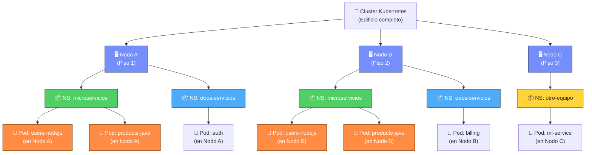

**Lo que ves en el diagrama:**

✅ El Namespace "microservicios" (verde) **abarca múltiples nodos:**
- `users-nodejs` en Nodo A ✓
- `products-java` en Nodo A ✓
- `users-nodejs` en Nodo B ✓
- `products-java` en Nodo B ✓

Todos son parte de **lo MISMO** (mismo namespace), pero en **diferentes máquinas físicas**.

✅ El Namespace "otros-servicios" (azul) **es completamente separado:**
- `auth` en Nodo A
- `billing` en Nodo B
- Pero **aislados** del namespace "microservicios"

### La pregunta de tu estudiante: "¿Qué significa que son 'parte de lo mismo'?"

Significa que:

1. **DNS compartida** 
   - Pod A en Nodo A puede llamar a Pod B en Nodo B usando:
     ```
     curl http://products-java:4020/api/products
     ```
   - Kubernetes resolve `products-java` a cualquier Pod en el mismo namespace, sin importar el nodo

2. **Reglas de red (Network Policy) aplicadas globalmente**
   - Una regla "deniega tráfico entre namespaces" se aplica a TODOS los nodos
   - Si dices "microservicios no puede hablar con otros-servicios", se cumple en Nodo A, Nodo B, Nodo C, etc.

3. **Cuotas y límites compartidos**
   - Si defines "namespace microservicios = máximo 100Gi de almacenamiento"
   - Se suma TODA la memoria usada en Nodo A + Nodo B + Nodo C

4. **Mismo contexto lógico**
   - Un equipo = gestiona 1 namespace
   - Otro equipo = gestiona otro namespace
   - No importa cuántos nodos ocupen; es una sola unidad conceptual

### En el Cluster de Docker Desktop

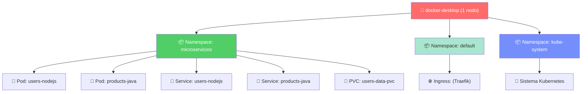

### ✅ Resumen rápido

| Pregunta | Respuesta |
|---|---|
| ¿Namespace es local a un nodo? | ❌ NO. Es **cluster-wide** |
| ¿Puedo tener el mismo namespace en múltiples nodos? | ✅ SÍ. De hecho, los namespaces ABARCAN múltiples nodos |
| ¿Pods de diferente namespace pueden comunicarse? | ❌ NO (están aislados) |
| ¿Pods del MISMO namespace en diferentes nodos pueden comunicarse? | ✅ SÍ (Kubernetes DNS los une) |
| ¿Es como una carpeta? | ❌ NO. Es como un **sector lógico de infraestructura** |
| ¿Cuánto namespace debo usar? | 1 por equipo / por ambiente (dev, staging, prod) |

---

## 🔐 Concepto: Control de Acceso (RBAC) - ⚠️ No implementado en este lab

**⚠️ ACLARACIÓN IMPORTANTE:** 

**En este laboratorio NO vas a crear Roles ni RoleBindings.** Tú (el admin) tienes acceso total al cluster de Docker Desktop. 

Pero **es importante que entiendas qué es RBAC** para:
- Entender producción (allá SÍ se usa)
- Imaginar: "Si mi compañero usara este cluster, ¿qué permisos le daría?"
- Siguientes módulos de seguridad en Kubernetes

---

### ¿Qué es RBAC en producción?

**Namespace aisla RECURSOS (Pods, Services, PVCs).** Pero ¿quién ACCEDE a los recursos?

Ejemplo real de producción:

```
Namespace "microservicios" = Donde están los Pods
RBAC = Quién puede acceder/modificarlos

Personas en la empresa:
├── Juan (Developer) 
│   └── Permisos: Ver Pods, logs, ejecutar kubectl exec
│      ❌ NO puede eliminar Pods
│      ❌ NO puede editar Deployments
│
├── María (DevOps)
│   └── Permisos: Ver/crear/editar/eliminar TODO
│      ✅ Puede hacer `kubectl apply` de manifiestos
│      ✅ Puede eliminar Pods si es necesario
│
├── Pedro (Intern)
│   └── Permisos: Solo ver (read-only)
│      ✅ Puede hacer `kubectl get pods`
│      ❌ NO puede cambiar nada
│
└── CI/CD (Script automático de despliegue)
    └── Permisos: Deploy nuevas versiones
       ✅ Puede actualizar Deployments
       ❌ NO puede eliminar infraestructura
```

### El error típico cuando RBAC no está configurado correctamente

```bash
$ kubectl delete pod users-nodejs-xxxxx
Error from server (Forbidden): pods "users-nodejs-xxxxx" is forbidden: 
User "juan" cannot delete resource "pods" in API group "" in the namespace "microservicios"
```

**Traducción:** "Juan NO tiene permiso para eliminar Pods aquí"

---

### Los 3 componentes de RBAC (para tu referencia)

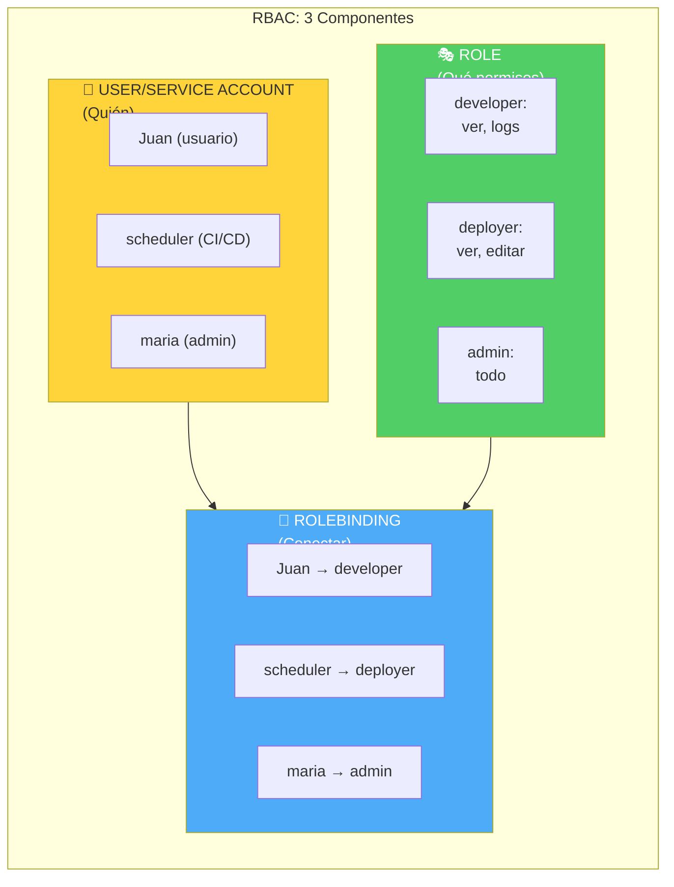

**En código Kubernetes (producción):**

```yaml
---
# 1. Define permisos (ROLE)
apiVersion: rbac.authorization.k8s.io/v1
kind: Role
metadata:
  name: developer
  namespace: microservicios
rules:
  - apiGroups: [""]
    resources: ["pods", "pods/logs"]
    verbs: ["get", "list", "watch"]  # Solo ver

---
# 2. Asigna permisos a una persona (ROLEBINDING)
apiVersion: rbac.authorization.k8s.io/v1
kind: RoleBinding
metadata:
  name: juan-es-developer
  namespace: microservicios
roleRef:
  apiGroup: rbac.authorization.k8s.io
  kind: Role
  name: developer
subjects:
  - kind: User
    name: "juan@empresa.com"
```

---

### ¿Cuándo usar RBAC?

| Escenario | ¿RBAC? |
|---|---|
| Tu laptop local (Docker Desktop) | ❌ NO (administrador) |
| Proyecto en clase con compañeros | ⚠️ OPCIONAL (para aprender conceptos) |
| Empresa real con 50 devs | ✅ SÍ (crítico) |
| App en Cloud (AWS EKS, GCP GKE) | ✅ SÍ (estándar) |

**En este lab:** Ignora RBAC. Tú tienes acceso total. 👑

---

5️⃣ **Nodo**
   - Máquina física o virtual que forma parte del cluster
   - En Docker Desktop: solo hay 1 nodo (`docker-desktop`)
   - En producción: 3, 10, 100+ nodos
   - Kubernetes decide EN CUÁL NODO ejecutar cada Pod

6️⃣ **Cluster**
   - La estructura completa de Kubernetes
   - Contiene Nodos + todos los recursos dentro
   - Control plane (master): gestiona todo
   - Data plane (workers): ejecutan Pods

**En este laboratorio, tu estructura es:**

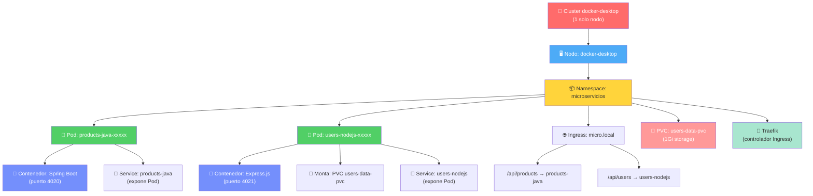

**Diferencia: Microservicio vs Pod vs Contenedor**

- **Microservicio**: concepto de arquitectura. En tu caso: "products" y "users"
- **Pod**: recurso de Kubernetes. En tu caso: 2 Pods (1 por microservicio)
- **Contenedor**: software ejecutándose. En tu caso: 2 contenedores (1 por Pod)

En este proyecto, 1 microservicio = 1 Pod = 1 contenedor (relación 1:1:1).
Pero en producción común: 1 microservicio = 1 Deployment = múltiples Pods = múltiples contenedores.

---

### 4.0 ⚙️ Configuración inicial: verificar Kubernetes en Docker Desktop

Antes de desplegar en Kubernetes, confirma que el cluster de Docker Desktop esta activo:

```bash
kubectl config get-contexts
kubectl config current-context
kubectl cluster-info
```

Explicacion:

- `kubectl config get-contexts`: lista todos los contextos configurados (clusters disponibles).
- `kubectl config current-context`: muestra el contexto activo en este momento (debe ser `docker-desktop`).
- `kubectl cluster-info`: muestra informacion adicional del cluster.

Si por alguna razon el contexto no es `docker-desktop`, actívalo con:

```bash
kubectl config use-context docker-desktop
```

Explicacion:

- `kubectl config use-context docker-desktop`: cambia el contexto al cluster local de Docker Desktop.

### 4.1 🏗️ Preparar imagenes: construir imagenes Docker para el cluster

Para este laboratorio con Docker Desktop local, usa imagenes locales sin registry.

Requisitos para esta seccion:

- Tener `kubectl` instalado.
- Docker Desktop con Kubernetes habilitado (ver seccion 0).

Build local de imagenes:

```bash
docker build -t products-java:1.0 ./products-java
docker build -t users-nodejs:1.0 ./users-nodejs
```

Explicacion:

- `docker build -t products-java:1.0 ./products-java`: construye imagen local de Java.
- `docker build -t users-nodejs:1.0 ./users-nodejs`: construye imagen local de Node.js.
- Estas imagenes son automaticamente visibles para el cluster de Docker Desktop.

Validacion:

```bash
kubectl config current-context
```

Verificar que la salida sea `docker-desktop`. Con esto, `docker build` y `kubectl` usan el mismo
entorno: no necesitas publicar imagenes en un registry para este laboratorio.

Si el cluster no encuentra imagenes locales (`ImagePullBackOff`), usa la opcion de registry remoto de esta guia.

Si necesitas trabajar con un registry remoto (opcional), entonces si aplica `TU_USUARIO`:

```bash
docker login
docker build -t TU_USUARIO/products-java:1.0 ./products-java
docker build -t TU_USUARIO/users-nodejs:1.0 ./users-nodejs
docker push TU_USUARIO/products-java:1.0
docker push TU_USUARIO/users-nodejs:1.0
```

Explicacion:

- `TU_USUARIO` es tu usuario/namespace en Docker Hub o registry privado.
- Este flujo es solo para despliegue no-local o cuando tu cluster no comparte imagenes locales.

### 4.2 📄 Manifests: archivos YAML que declaran el estado deseado

En este proyecto los manifests ya vienen configurados para Docker Desktop (local):

- `products-java:1.0`
- `users-nodejs:1.0`

Con Docker Desktop, estas imagenes son automaticamente accesibles para el cluster. Si usas un
registry remoto, cambia esos valores en los deployments por tus imagenes publicadas.

### 4.1.5 ⚠️ Verificar / Instalar Traefik Ingress Controller

**¿Tiene Docker Desktop Traefik instalado?** Depende de tu versión. Vamos a verificar:

```bash
kubectl get pods -n kube-system | grep traefik
```

**Si ves una línea con `traefik`:** ✅ Genial, ya está instalado. **Continúa con 4.3**.

**Si NO ves nada:** ⚠️ Necesitas instalarlo (5 minutos):

#### Instalar Traefik con Helm (Opción recomendada)

```bash
# 1. Agregar el repositorio de Traefik
helm repo add traefik https://traefik.github.io/charts
helm repo update

# 2. Instalar Traefik
helm install traefik traefik/traefik \
  --namespace kube-system \
  --set service.type=LoadBalancer

# 3. Esperar a que se inicie (puede tomar 30-60 segundos)
kubectl get pods -n kube-system | grep traefik
```

**¿Qué hace este comando?**
- `helm install traefik traefik/traefik`: descarga e instala Traefik desde el repositorio oficial
- `--namespace kube-system`: lo coloca en el namespace del sistema (donde van los controladores)
- `--set service.type=LoadBalancer`: configura el servicio como LoadBalancer para recibir tráfico en localhost:80

**Salida esperada después de unos segundos:**
```
traefik-xxxxx   1/1   Running   0   5m
```

Una vez veas `Running`, Traefik está listo. Continúa con sección 4.3.

---

### 4.3 🚀 Despliegue: aplicar manifests al cluster

Desde la raiz `microservicios`:

```bash
kubectl apply -f k8s/namespace.yaml
kubectl apply -f users-nodejs/k8s/pvc.yaml
kubectl apply -f products-java/k8s/deployment.yaml
kubectl apply -f users-nodejs/k8s/deployment.yaml
```

Explicacion de cada linea:

- `kubectl apply`: crea o actualiza recursos declarados en un archivo YAML.
- `-f`: indica el archivo a aplicar.
- `k8s/namespace.yaml`: crea namespace `microservicios`.
- `users-nodejs/k8s/pvc.yaml`: crea el PVC para persistencia de usuarios.
- `products-java/k8s/deployment.yaml`: crea/actualiza Deployment + Service de products.
- `users-nodejs/k8s/deployment.yaml`: crea/actualiza Deployment + Service de users.

Por que este orden es necesario:

- `k8s/namespace.yaml` va primero porque todos los demas recursos se crean dentro de `microservicios`; si el namespace no existe, los apply siguientes fallan.
- `users-nodejs/k8s/pvc.yaml` va antes del deployment de users porque el Pod necesita ese claim para montar `/app/data`; si el PVC no existe, el Pod puede quedar en estado pendiente o con error de montaje.
- `products-java/k8s/deployment.yaml` crea el servicio de products y su Pod; se aplica despues del namespace para asegurar aislamiento y nombres consistentes.
- `users-nodejs/k8s/deployment.yaml` se aplica al final para que encuentre el PVC ya creado y pueda iniciar con persistencia activa desde el primer arranque.

En resumen, la secuencia evita errores de dependencias: primero contenedor logico (namespace), luego almacenamiento (PVC), y despues workloads (deployments/services).

### 4.4 ✅ Verificación: comprobar que todo está ejecutándose

```bash
kubectl get ns
kubectl get pods -n microservicios
kubectl get svc -n microservicios
kubectl get pvc -n microservicios
```

Explicacion:

- `kubectl get ns`: lista namespaces del cluster.
- `kubectl get pods -n microservicios`: lista pods del namespace objetivo.
- `kubectl get svc -n microservicios`: lista servicios y puertos publicados dentro del cluster.
- `kubectl get pvc -n microservicios`: muestra estado del claim (`Bound`, `Pending`, etc.).
- `-n microservicios`: limita la consulta al namespace del proyecto.

Estados comunes del PVC y como interpretarlos:

- `Bound`: estado esperado. El claim ya fue enlazado a un volumen real y el Pod puede montar almacenamiento persistente.
- `Pending`: Kubernetes aun no encuentra o no puede aprovisionar almacenamiento para ese claim.
- `Lost`: el claim estaba enlazado pero perdio su volumen asociado.

Que hacer si aparece `Pending`:

```bash
kubectl get storageclass
kubectl describe pvc users-data-pvc -n microservicios
kubectl get events -n microservicios --sort-by=.metadata.creationTimestamp
```

Explicacion rapida:

- `kubectl get storageclass`: confirma si existe una clase de almacenamiento disponible.
- `kubectl describe pvc ...`: muestra el motivo exacto del `Pending` (por ejemplo, falta de StorageClass).
- `kubectl get events ...`: entrega eventos recientes para detectar errores de aprovisionamiento.

### 4.5 🔌 Testing local: port-forward para acceder desde tu Mac

Abre dos terminales:

```bash
kubectl port-forward svc/products-java 4020:4020 -n microservicios
kubectl port-forward svc/users-nodejs 4021:4021 -n microservicios
```

Explicacion:

- `kubectl port-forward`: expone temporalmente un servicio del cluster en tu maquina local.
- `svc/products-java`: service de destino de products.
- `svc/users-nodejs`: service de destino de users.
- `4020:4020` y `4021:4021`: puerto local:puerto remoto del service.
- `-n microservicios`: namespace donde estan los servicios.
- Estos comandos quedan en primer plano; usa una terminal por servicio.

Luego prueba:

```bash
curl http://localhost:4020/api/products
curl http://localhost:4021/api/users
```

Explicacion:

- `curl` envia requests HTTP de prueba.
- `localhost:4020` prueba products via port-forward.
- `localhost:4021` prueba users via port-forward.

### 4.6 📈 Escalado: demostración de multi-replica (bonus)

Este paso permite mostrar que puedes tener varias replicas de cada app y, aun asi, seguir teniendo solo dos microservicios logicos (`products-java` y `users-nodejs`).

Escalar deployments a 3 replicas:

```bash
kubectl scale deployment/products-java --replicas=3 -n microservicios
kubectl scale deployment/users-nodejs --replicas=3 -n microservicios
```

Explicacion:

- `kubectl scale`: cambia la cantidad de pods de un Deployment.
- `deployment/products-java`: deployment que se escala.
- `deployment/users-nodejs`: deployment que se escala.
- `--replicas=3`: cantidad objetivo de pods.
- `-n microservicios`: namespace donde viven los deployments.

Verificar replicas:

```bash
kubectl get deployments -n microservicios
kubectl get pods -n microservicios -o wide
kubectl get svc -n microservicios
```

Que deberias observar:

- En `deployments`, cada servicio muestra `3/3` replicas listas.
- En `pods`, aparecen 3 pods para products y 3 pods para users.
- En `svc`, siguen existiendo solo 2 servicios (`products-java` y `users-nodejs`).
- Conclusion: hay mas instancias (pods), pero la cantidad de microservicios logicos no cambia.

Volver a 1 replica por servicio:

```bash
kubectl scale deployment/products-java --replicas=1 -n microservicios
kubectl scale deployment/users-nodejs --replicas=1 -n microservicios
```

### 4.7 🌐 Ingress + Traefik: acceso desde navegador con dominio local

**¿Qué es un Ingress?**

- **Ingress** es un recurso de Kubernetes que define reglas HTTP/HTTPS para el tráfico de **entrada** al cluster.
- **Problema que resuelve:** Sin Ingress, cada microservicio necesitaría su propio puerto expuesto (NodePort), lo que es tedioso y poco escalable.
- **Solución:** Centraliza toda la lógica de enrutamiento en un único punto de entrada.

**¿Qué es Traefik?**

Traefik es un **Ingress Controller** — el software que entiende los objetos Ingress y los ejecuta.

- Lee los archivos `Ingress.yaml` que defines en el cluster
- Escucha en puerto 80 (HTTP) y 443 (HTTPS) de tu máquina
- **Actúa como proxy reverso:** es el *único punto de entrada* al cluster
  - Recibe requests externas (navegador, Postman, curl)
  - Decide a qué Service interno enviar la request basándose en host y path
  - El cliente no sabe dónde están realmente los microservicios \u2014 solo habla con Traefik

**Analogía:** Traefik es como un **recepcionista en la entrada de una empresa**:
- Cliente llama: \"Quiero hablar con ventas\"
- Recepcionista (Traefik): \"Déjame dirigirte a la oficina correcta\"
- Cliente nunca ve todas las oficinas, solo interactúa con la recepción

**¿Por qué es necesario?**

- Sin Ingress, cada servicio suele necesitar su propio mecanismo de exposicion.
- Con Ingress, puedes publicar multiples microservicios bajo un mismo punto de entrada.
- Facilita agregar TLS, hostnames y **reglas centralizadas**. Por "reglas centralizadas" se
  entiende que en lugar de configurar cada microservicio por separado para manejar seguridad,
  rutas o dominios, todas esas decisiones se definen en un solo lugar (el manifiesto Ingress).
  Por ejemplo:
  - **TLS**: en vez de instalar un certificado SSL en cada microservicio, se configura una
    vez en el Ingress y Traefik termina la conexion HTTPS antes de reenviar al servicio interno.
  - **Hostnames**: se puede enrutar `api.miapp.cl` a un servicio y `admin.miapp.cl` a otro,
    sin tocar el codigo de ninguno.
  - **Redirects, rate limiting, autenticacion basica**: se activan como middlewares en Traefik
    y aplican a todos los servicios que pasen por el, sin duplicar logica en cada uno.

**Pasos para configurar Ingress + Traefik:**

1. Verificar que Traefik este disponible.

```bash
kubectl get ingressclass
kubectl get pods -A | grep -i traefik
```

`kubectl get ingressclass` lista los controladores de Ingress registrados en el cluster.
Docker Desktop instala Traefik automaticamente en su cluster Kubernetes, por lo que no es
necesario instalarlo manualmente. La salida esperada es:

```
NAME      CONTROLLER                      PARAMETERS   AGE
traefik   traefik.io/ingress-controller   <none>       24h
```

- `NAME`: el valor que vas a poner en `ingressClassName: traefik` dentro del YAML de Ingress.
- `CONTROLLER`: identifica que pod es responsable de leer y aplicar las reglas de enrutamiento.
- `PARAMETERS`: sin configuracion extra; usa los valores por defecto de Traefik.
- `AGE`: tiempo desde que iniciaste Kubernetes en Docker Desktop.

`kubectl get pods -A | grep -i traefik` muestra todos los pods relacionados con Traefik en
cualquier namespace. La salida esperada es:

```
kube-system   helm-install-traefik-xxxxx       0/1   Completed   1   24h
kube-system   helm-install-traefik-crd-xxxxx   0/1   Completed   0   24h
kube-system   svclb-traefik-xxxxx              2/2   Running     2   24h
kube-system   traefik-xxxxx                    1/1   Running     2   24h
```

- `helm-install-traefik`: job que instalo Traefik via Helm al crear el cluster. Estado
  `Completed` es normal: se ejecuta una vez y queda como registro historico.
- `helm-install-traefik-crd`: job que instalo los CRDs (tipos de objetos adicionales que
  Traefik registra en Kubernetes). Tambien `Completed` es el estado esperado.
- `svclb-traefik`: ServiceLB, el balanceador de carga liviano de k3s. Es el que expone el
  puerto 80 y 443 de tu maquina hacia el pod de Traefik. Sin el, el trafico externo no
  entraria al cluster.
- `traefik`: el pod principal, el proxy reverso en si. Lee los objetos Ingress que defines y
  decide a que Service derivar cada request segun el path de la URL.

El flujo completo de una request via Ingress es:

```mermaid
flowchart LR
    USER["👤 Cliente<br/>curl http://micro.local/api/products"]
    PORT["🔌 Puerto 80<br/>(tu Mac)"]
    LB["⚖️ svclb-traefik<br/>(entra al cluster)"]
    TRAEFIK["🚦 Traefik Pod<br/>(lee Ingress)<br/>decide destino por path"]
    SVC["🔌 Service<br/>products-java:4020<br/>(ClusterIP interno)"]
    POD["🐳 Pod Spring Boot<br/>puerto 4020<br/>responde"]
    
    USER -->|localhost:80| PORT
    PORT -->|solicitud HTTP| LB
    LB -->|entra al cluster| TRAEFIK
    TRAEFIK -->|path: /api/products| SVC
    SVC -->|redirecciona| POD
    POD -->|respuesta JSON| USER
    
    style USER fill:#ffd43b,color:#333
    style PORT fill:#a8e6cf,color:#333
    style LB fill:#748ffc,color:#fff
    style TRAEFIK fill:#f0a,color:#fff
    style SVC fill:#4dabf7,color:#fff
    style POD fill:#51cf66,color:#fff
```

2. Aplicar el manifiesto Ingress.

```bash
kubectl apply -f k8s/ingress-traefik.yaml
kubectl get ingress -n microservicios
```

`kubectl apply -f k8s/ingress-traefik.yaml` registra en el cluster las reglas de enrutamiento
definidas en el YAML: le dice a Traefik que cuando llegue una request con el host `micro.local`
y el path `/api/products`, la derive al Service `products-java`, y lo mismo para `/api/users`.
Sin aplicar este archivo, Traefik no sabe nada de tus microservicios; solo tiene el controlador
activo pero sin reglas configuradas.

`kubectl get ingress -n microservicios` verifica que el objeto Ingress fue creado correctamente.
La salida esperada muestra el host `micro.local`, los paths configurados y el puerto 80. Si la
columna `ADDRESS` aparece vacia, espera unos segundos y vuelve a ejecutarlo.

3. Agregar resolucion local para `micro.local` (mantener mientras uses el cluster).

```bash
echo "127.0.0.1 micro.local" | sudo tee -a /etc/hosts
```

✅ **MANTÉN esta entrada mientras estes usando Kubernetes en el laboratorio**.
❌ Solo la eliminara cuando hagas limpieza completa (ver seccion 4.9).

Este paso es necesario aunque el Ingress ya este aplicado. El motivo es que Kubernetes e Ingress
solo resuelven el enrutamiento **dentro del cluster**: Traefik sabe que `micro.local/api/products`
va al Service correcto, pero tu Mac no sabe a que IP apunta el nombre `micro.local`. Sin este
paso, el sistema operativo intenta resolver `micro.local` via DNS, no encuentra nada, y la
conexion falla antes de llegar al cluster.

El comando agrega una linea al archivo `/etc/hosts` de macOS, que es el primer lugar donde el
sistema operativo busca nombres de host antes de consultar un servidor DNS:

```
127.0.0.1   micro.local
```

Esto le indica a tu Mac: "cuando alguien pida `micro.local`, dirigelo a localhost (127.0.0.1)".
Desde ahi, `svclb-traefik` (que escucha en el puerto 80 de localhost) recibe la request y la
pasa al pod de Traefik, que aplica las reglas del Ingress.

**Ciclo de vida de esta entrada:**

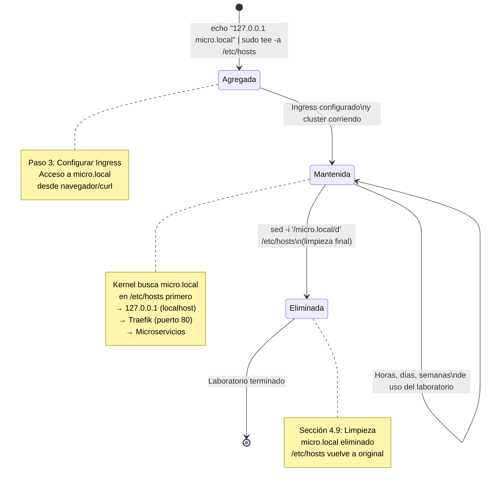

Desglose del comando:
- `echo "127.0.0.1 micro.local"`: genera el texto de la linea a agregar.
- `|`: pasa ese texto como entrada al siguiente comando.
- `sudo tee -a /etc/hosts`: escribe el texto al final del archivo `/etc/hosts` con permisos de
  administrador (`-a` significa append, agrega sin borrar lo que ya existe).

En Windows (PowerShell como Administrador), el equivalente es:

```powershell
Add-Content -Path "C:\Windows\System32\drivers\etc\hosts" -Value "127.0.0.1 micro.local"
```

O manualmente: clic derecho en Notepad → "Ejecutar como administrador" → Archivo → Abrir
→ `C:\Windows\System32\drivers\etc\hosts` → agregar `127.0.0.1 micro.local` al final → guardar.

No existe `sudo` en Windows; la elevacion de privilegios se obtiene ejecutando la aplicacion
o terminal como Administrador.

4. Probar requests via Ingress.

```bash
curl http://micro.local/api/products
curl http://micro.local/api/users
```

Nota:

- Si `micro.local` no responde, prueba con header Host:

```bash
curl -H "Host: micro.local" http://127.0.0.1/api/products
curl -H "Host: micro.local" http://127.0.0.1/api/users
```

Ingress vs API Gateway:

- Ingress y API Gateway no son exactamente lo mismo.
- Ingress (con Traefik) resuelve principalmente enrutamiento HTTP/HTTPS y terminacion TLS.
- Un API Gateway completo suele agregar politicas avanzadas: autenticacion centralizada, quotas, rate limit por consumidor, versionado, analitica y monetizacion.
- En proyectos pequenos/medianos, Traefik + middlewares puede cubrir parte del rol de API Gateway.

### 4.7.1 🔐 Bonus: Secret simple en Kubernetes (opcional)

En esta seccion agregamos un ejemplo minimo para explicar secretos de forma didactica.

⚠️ Importante:
- Un `Secret` evita hardcodear valores sensibles en codigo o manifests.
- En este laboratorio usaremos un valor demo (no productivo).
- Nunca subas secretos reales a Git.

#### A) Variable de ambiente simple (no secreta)

Para valores no sensibles (por ejemplo `APP_MODE=dev`) puedes definir una variable normal en el Deployment:

```yaml
env:
  - name: APP_MODE
    value: "dev"
```

Esto es util para configuracion comun, pero no para tokens, passwords o API keys.

#### B) Variable de ambiente desde Secret (sensible)

1. Crear el Secret desde linea de comandos.

```bash
kubectl create secret generic users-api-secret \
  --from-literal=API_TOKEN=token-demo-fullstack3 \
  -n microservicios
```

Explicacion:
- `create secret generic`: crea un objeto `Secret` de tipo clave/valor.
- `--from-literal=API_TOKEN=...`: define la clave `API_TOKEN`.
- `-n microservicios`: lo crea en el mismo namespace de la app.

2. Verificar que el Secret exista (sin imprimir el valor).

```bash
kubectl get secret users-api-secret -n microservicios
kubectl describe secret users-api-secret -n microservicios
```

3. Inyectar el Secret como variable de entorno en `users-nodejs`.

Agrega este bloque dentro del contenedor en `users-nodejs/k8s/deployment.yaml`:

```yaml
env:
  - name: APP_MODE
    value: "dev"
  - name: API_TOKEN
    valueFrom:
      secretKeyRef:
        name: users-api-secret
        key: API_TOKEN
```

Luego reaplica el deployment:

```bash
kubectl apply -f users-nodejs/k8s/deployment.yaml
```

4. Probar que ambas variables existen en el pod.

```bash
kubectl get pods -n microservicios
kubectl exec -it <NOMBRE_POD_USERS> -n microservicios -- printenv APP_MODE
kubectl exec -it <NOMBRE_POD_USERS> -n microservicios -- printenv API_TOKEN
```

Salida esperada:

```text
dev
token-demo-fullstack3
```

5. Limpieza del ejemplo (opcional).

```bash
kubectl delete secret users-api-secret -n microservicios
```

#### C) ¿Dónde viven los Secrets en Kubernetes?

Respuesta corta:
- Viven como objetos `Secret` dentro de la API de Kubernetes (en el namespace correspondiente).
- El cluster los persiste en `etcd`.
- Por defecto van codificados en base64 (esto no es cifrado fuerte por si solo).

Buenas practicas de plataforma:
- Habilitar encryption at rest para Secrets en `etcd`.
- Limitar acceso con RBAC.
- Evitar imprimir secretos en logs o `kubectl describe` con valores expuestos.

#### D) ¿En producción siempre se crean por linea de comandos?

No. `kubectl create secret ...` es util para demos o pruebas rapidas, pero en produccion normalmente se usa alguno de estos enfoques:

1. GitOps + cifrado de manifiestos
- Ejemplo: `SealedSecrets` o `SOPS`.
- El repositorio guarda solo la version cifrada.

2. Gestor externo de secretos
- Ejemplo: Vault, AWS Secrets Manager, GCP Secret Manager, Azure Key Vault.
- Kubernetes sincroniza secretos mediante `External Secrets Operator` o CSI drivers.

3. Pipeline CI/CD
- El pipeline inyecta secretos en deploy sin dejarlos en texto plano en el repo.

Resumen pedagógico:
- `ConfigMap`: configuracion no sensible.
- `Secret`: datos sensibles.
- Una variable de entorno puede venir de `value` (simple) o `secretKeyRef` (sensible).
- En produccion, no depender solo de CLI manual: usar automatizacion + cifrado + control de acceso.

### 4.8 🏛️ Arquitectura: diagrama completo del sistema

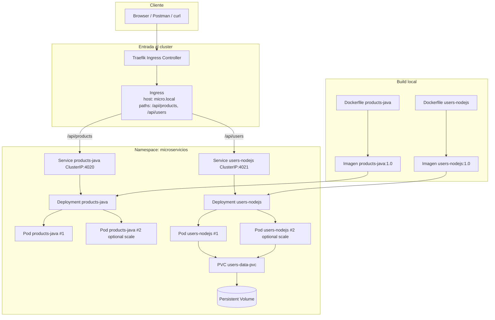

### 4.9 🧹 Limpieza: desmantelar el cluster completamente

Desde la raiz `microservicios`:

```bash
kubectl delete -f k8s/ingress-traefik.yaml --ignore-not-found
kubectl delete -f users-nodejs/k8s/deployment.yaml --ignore-not-found
kubectl delete -f products-java/k8s/deployment.yaml --ignore-not-found
kubectl delete -f users-nodejs/k8s/pvc.yaml --ignore-not-found
kubectl delete -f k8s/namespace.yaml --ignore-not-found
```

Explicacion de cada linea:

- `kubectl delete`: elimina recursos definidos en archivos YAML.
- `-f`: indica el archivo fuente.
- `--ignore-not-found`: evita error si el recurso ya no existe.
- `k8s/ingress-traefik.yaml`: elimina las reglas de enrutamiento del Ingress de Traefik.
- `users-nodejs/k8s/deployment.yaml`: elimina Deployment + Service de users y sus Pods.
- `products-java/k8s/deployment.yaml`: elimina Deployment + Service de products y sus Pods.
- `users-nodejs/k8s/pvc.yaml`: elimina el PVC de users. Los datos del volumen dependen de
  la reclaim policy del StorageClass (`local-path` los elimina junto con el PVC).
- `k8s/namespace.yaml`: elimina el namespace `microservicios` y todo lo que quede dentro
  en cascada (Services, ConfigMaps, Pods remanentes, etc.).

Nota sobre Pods y Services: no es necesario eliminarlos individualmente. Al eliminar un
Deployment, Kubernetes termina y borra los Pods que gestionaba. Al eliminar el namespace,
todo su contenido cae en cascada automaticamente.

Eliminar la entrada `micro.local` del archivo hosts al FINALIZAR (limpieza completa):

⚠️ **IMPORTANTE**: Este comando BORRA la linea `127.0.0.1 micro.local` de forma permanente.
No ejecutes esto mientras estes usando Kubernetes; solo al terminar el laboratorio completamente.

macOS/Linux:
```bash
sudo sed -i '' '/micro\.local/d' /etc/hosts
```

Explicacion:
- `sudo sed -i ''`: edita el archivo en su lugar sin backup (opcion `-i ''` requerida en macOS).
- `'/micro\.local/d'`: patrón de busqueda (`/micro\.local/`) + accion borrado (`d`).
- Ejemplo: si tu archivo hosts contiene:
  ```
  127.0.0.1 localhost
  127.0.0.1 micro.local
  ```
  Despues del comando solo quedara:
  ```
  127.0.0.1 localhost
  ```

Windows (PowerShell como Administrador):
```powershell
(Get-Content "C:\Windows\System32\drivers\etc\hosts") |
  Where-Object { $_ -notmatch 'micro\.local' } |
  Set-Content "C:\Windows\System32\drivers\etc\hosts"
```

Explicacion:
- `Get-Content`: lee el archivo hosts linea por linea.
- `Where-Object { $_ -notmatch 'micro\.local' }`: conserva SOLO las lineas que NO contienen `micro.local`.
- `Set-Content`: reescribe el archivo con el resultado filtrado.
- Resultado final: la linea `127.0.0.1 micro.local` desaparece permanentemente.

Opcional: limpiar imagenes locales Docker despues del laboratorio:

```bash
docker rmi -f products-java:1.0 users-nodejs:1.0 2>/dev/null || true
docker image prune -f
```

Explicacion:

- `docker rmi -f ...`: elimina las imagenes etiquetadas del proyecto.
- `2>/dev/null || true`: oculta errores si alguna imagen no existe; en Git Bash (Windows)
  este redireccionamiento funciona igual que en macOS/Linux.
- `docker image prune -f`: elimina imagenes sin tag no usadas por ningun contenedor.

### 4.10 🧪 Bonus: ¿Cómo dar acceso del JSON a `products-java`?

Pregunta frecuente:

> "Si `users-nodejs` guarda datos en `data.json`, ¿puede `products-java` leer ese mismo archivo?"

Respuesta corta:
- **Sí, técnicamente es posible** en Docker run, Docker Compose y Kubernetes.
- **Pero no es lo recomendado** para microservicios en producción.
- Recomendación arquitectónica: `products-java` debería consumir datos por API de `users-nodejs`, no por archivo compartido.

#### Estado actual del proyecto

Con la configuración actual:
- `users-nodejs` sí monta el archivo/persistencia de usuarios.
- `products-java` no monta ese volumen.
- Por lo tanto, hoy `products-java` **no puede** leer `data.json` por filesystem.

#### A) Dockerfile / docker run (sí es posible)

Puedes montar el mismo archivo host también en el contenedor Java:

```bash
docker run -d --name products-java -p 4020:4020 \
  -v $(pwd)/users-nodejs/data/data.json:/app/shared/users.json:ro \
  products-java:1.0
```

Notas:
- `:ro` monta en solo lectura (recomendado para evitar escrituras accidentales).
- Esto solo da acceso al archivo; para usarlo, la app Java debe tener código que lea `/app/shared/users.json`.

#### B) Docker Compose (sí es posible)

En `docker-compose.yml`, monta el mismo volumen en ambos servicios:

```yaml
services:
  users-nodejs:
    volumes:
      - ./users-nodejs/data/data.json:/app/data/data.json

  products-java:
    volumes:
      - ./users-nodejs/data/data.json:/app/shared/users.json:ro
```

Notas:
- Funciona bien para laboratorio local.
- En producción con microservicios, compartir archivos entre servicios suele ser antipatrón.

#### C) Kubernetes (sí es posible, con consideraciones)

Puedes montar el mismo PVC en `products-java`.

Ejemplo en `products-java/k8s/deployment.yaml`:

```yaml
spec:
  template:
    spec:
      containers:
        - name: products-java
          volumeMounts:
            - name: users-shared-data
              mountPath: /app/shared
              readOnly: true
      volumes:
        - name: users-shared-data
          persistentVolumeClaim:
            claimName: users-data-pvc
```

Consideraciones reales:
- Si el PVC es `ReadWriteOnce`, el comportamiento depende de StorageClass/nodo.
- En Docker Desktop (1 nodo) normalmente se puede probar sin problema.
- En clusters multinodo, para acceso concurrente multi-pod/multi-nodo suele requerirse `ReadWriteMany` + backend compatible (NFS/EFS/CephFS, etc.).

¿Qué significa exactamente "depende de StorageClass/nodo"?

- **Depende del StorageClass** porque ese recurso define el tipo de almacenamiento real (disco local, NFS, EBS/EFS, Ceph, etc.) y sus capacidades.
- **Depende del nodo** porque algunos volúmenes solo pueden montarse en un nodo a la vez (por ejemplo, muchos casos con `ReadWriteOnce`).

Ejemplo práctico:

1. Si `users-nodejs` y `products-java` estan en el **mismo nodo**:
  - Con `ReadWriteOnce` normalmente ambos pods pueden montar el volumen sin problema.

2. Si Kubernetes agenda un pod en **otro nodo distinto**:
  - Con `ReadWriteOnce`, puede fallar el montaje o quedar el pod en `Pending`, porque el volumen ya esta "atado" a otro nodo.

3. Si quieres acceso simultaneo desde varios nodos:
  - Necesitas `ReadWriteMany` y un backend compatible (NFS/EFS/CephFS, etc.).

Comandos de verificacion utiles:

```bash
kubectl get pvc users-data-pvc -n microservicios -o yaml
kubectl get storageclass
kubectl get pods -n microservicios -o wide
kubectl describe pod <NOMBRE_POD> -n microservicios
```

Que mirar:
- `accessModes` del PVC (`ReadWriteOnce` o `ReadWriteMany`).
- `storageClassName` del PVC y su tipo de provisionamiento.
- En que nodo quedo cada pod (`NODE` en `kubectl get pods -o wide`).
- Eventos de error de montaje en `kubectl describe pod`.

#### ¿Entonces cuándo conviene y cuándo no?

Conviene en escenarios didácticos cuando se quiere mostrar:
- Montaje de volúmenes.
- Diferencia entre acceso por red (API) vs acceso por filesystem.

Evítalo en diseño productivo de microservicios cuando:
- Quieres bajo acoplamiento entre servicios.
- Necesitas independencia de despliegue y versionado.
- Quieres que cada servicio sea dueño de sus datos.

Regla práctica:
- **Didáctico:** compartir volumen puede servir para entender persistencia.
- **Producción:** preferir comunicación por API/eventos, no por archivo compartido.

---

## 5) API Gateway + Frontend React: e2e completo

**Objetivo:** Agregar un API Gateway (KrakenD) entre Traefik y los microservicios, y un frontend React
que consuma las APIs. Con esto el flujo end-to-end queda completo: navegador → Traefik → KrakenD
→ microservicios.

**Qué aprenderás:** Qué es un API Gateway y por qué existe, build multi-stage de Docker para
frontend estático, ConfigMap como mecanismo de configuración de KrakenD.

---

### 5.1 🧠 Concepto: ¿Qué es un API Gateway y por qué no basta con Traefik?

Traefik ya enruta tráfico — ¿entonces para qué agregar KrakenD?

| Responsabilidad | Traefik (ya tenés) | KrakenD (nuevo) |
|---|---|---|
| Enrutamiento por host/path | ✅ | ✅ |
| TLS termination (HTTPS) | ✅ | ❌ (no es su rol) |
| Rate limiting por consumidor | Básico | ✅ por API key/JWT |
| Transformación de requests | Limitado | ✅ |
| Agregación de múltiples backends | ❌ | ✅ |
| Validación JWT / API Keys | ❌ | ✅ |
| Analytics por endpoint/consumidor | ❌ | ✅ |

**Regla simple:** Traefik es la puerta del edificio (quién entra al cluster). KrakenD es la
recepcionista (a qué piso y con qué permisos).

Ambos coexisten sin solaparse:

```
Browser
  └─► Traefik (edge del cluster, TLS, entrada)
        └─► KrakenD (API Gateway: auth, rate limit, agregación)
              ├─► products-java:4020
              └─► users-nodejs:4021
```

KrakenD es **stateless**: no tiene base de datos. Toda su configuración vive en un archivo
`krakend.json` que se monta en el pod como un **ConfigMap** de Kubernetes. Esto lo hace
ideal para IaC: la configuración es código, versionada en git.

---

### 5.2 🌐 Concepto: ¿Por qué nginx para el frontend y no Node.js?

El build de Vite (React) produce HTML + JS + CSS puros — no hay lógica de servidor.
nginx sirve esos archivos estáticos de forma mucho más eficiente que Node.js:

- Sin runtime de JavaScript en producción
- Sin Garbage Collector
- Cache HTTP nativo (`Cache-Control`, `ETag`)
- Imagen Docker final: **~25MB** (vs ~400MB con node_modules)

El truco está en el **Dockerfile multi-stage**:

```
Stage 1: node:20-alpine          Stage 2: nginx:alpine
├── npm ci                       ├── COPY --from=builder /app/dist
├── npm run build                │     /usr/share/nginx/html
└── genera /app/dist/            └── imagen final sin node_modules
     (HTML/JS/CSS puro)
```

El stage 2 solo copia el resultado compilado del stage 1. `node_modules` nunca entra
a la imagen final.

---

### 5.3 🏗️ Archivos nuevos en el proyecto

```
microservicios/
├── frontend-react/
│   ├── Dockerfile              ← multi-stage: node build → nginx serve
│   ├── nginx.conf              ← fallback a index.html para React Router
│   ├── package.json
│   ├── vite.config.js          ← proxy /api en desarrollo local
│   ├── index.html
│   ├── src/
│   │   ├── main.jsx
│   │   └── App.jsx             ← consume /api/products y /api/users
│   └── k8s/
│       └── deployment.yaml     ← Deployment nginx + Service ClusterIP
├── krakend/
│   └── k8s/
│       ├── krakend-config.yaml ← ConfigMap con krakend.json
│       └── deployment.yaml     ← Deployment KrakenD + Service ClusterIP
└── k8s/
    ├── ingress-traefik.yaml           ← Fase 4 (sin cambios)
    └── ingress-traefik-v2-gateway.yaml ← Fase 5 (reemplaza al anterior)
```

---

### 5.4 🔧 Arquitectura: diagrama e2e completo

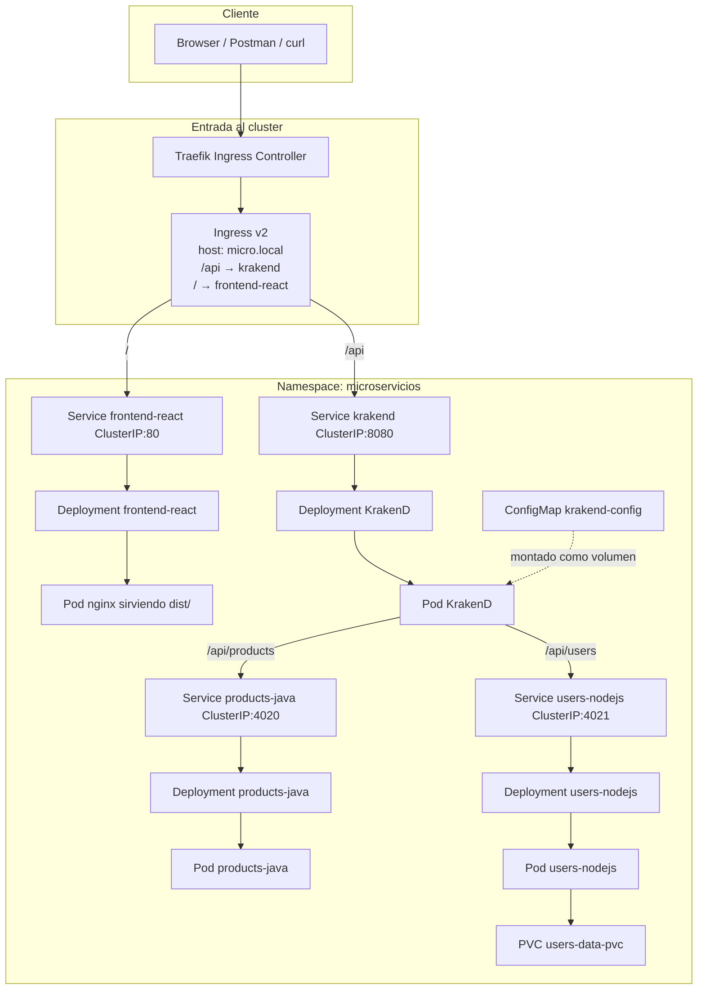

---

### 5.5 🚀 Despliegue: pasos para levantar la fase 5

#### Paso 1: Construir las imágenes

```bash
docker build -t frontend-react:1.0 ./frontend-react
```

KrakenD usa la imagen oficial `devopsfaith/krakend:2.7` — no necesita build local.

#### Paso 2: Aplicar los manifests de KrakenD

```bash
kubectl apply -f krakend/k8s/krakend-config.yaml
kubectl apply -f krakend/k8s/deployment.yaml
```

Explicacion:
- `krakend-config.yaml`: crea el ConfigMap con `krakend.json` (rutas, backends, timeouts).
- `deployment.yaml`: crea el Deployment que usa la imagen oficial y monta el ConfigMap,
  más el Service ClusterIP que Traefik usará para enrutar `/api`.

#### Paso 3: Aplicar el manifest del frontend

```bash
kubectl apply -f frontend-react/k8s/deployment.yaml
```

Explicacion:
- Crea el Deployment de nginx con la imagen `frontend-react:1.0`.
- Crea el Service ClusterIP que Traefik usará para enrutar `/`.

#### Paso 4: Reemplazar el Ingress (el único cambio visible para el cluster)

```bash
kubectl apply -f k8s/ingress-traefik-v2-gateway.yaml
```

Como el nuevo Ingress tiene el mismo `name: microservicios-ingress`, el `apply` lo
sobreescribe en el cluster sin necesidad de borrar nada manual. Traefik detecta el cambio
y actualiza sus rutas automáticamente.

**Diferencia entre v1 y v2:**

| Path | Ingress v1 (Fase 4) | Ingress v2 (Fase 5) |
|---|---|---|
| `/api/products` | → products-java:4020 | — |
| `/api/users` | → users-nodejs:4021 | — |
| `/api` (todo) | — | → krakend:8080 |
| `/health` | → users-nodejs:4021 | → krakend:8080 |
| `/` | — | → frontend-react:80 |

#### Paso 5: Verificar que todos los pods están Running

```bash
kubectl get pods -n microservicios
```

Deberías ver estos 4 pods:

```
NAME                              READY   STATUS    RESTARTS
frontend-react-xxxxx              1/1     Running   0
krakend-xxxxx                     1/1     Running   0
products-java-xxxxx               1/1     Running   0
users-nodejs-xxxxx                1/1     Running   0
```

#### Paso 6: Probar el sistema completo

```bash
# Frontend React (navegador o curl)
curl http://micro.local

# API a través de KrakenD
curl http://micro.local/api/products
curl http://micro.local/api/users

# Health check
curl http://micro.local/health
```

Oo abrir directamente `http://micro.local` en el navegador — verás el frontend React
cargando los datos de los dos microservicios.

---

### 5.6 💻 Desarrollo local del frontend (sin cluster)

Para iterar en el frontend sin necesitar Kubernetes:

```bash
# Terminal 1: levantar los microservicios
docker compose up -d

# Terminal 2: frontend en modo dev
cd frontend-react
npm install
npm run dev
# → http://localhost:3000
```

El `vite.config.js` ya tiene configurado el proxy para que `/api` en local apunte
a `http://localhost:8080`. Si no tenés KrakenD local corriendo, podés ajustarlo
tranquilamente para que apunte directo a `http://localhost:4020` y `http://localhost:4021`
durante el desarrollo.

### 5.9 Frontend preparado para autenticacion

Desde esta fase el frontend ya incluye los formularios de **Iniciar sesión** y
**Crear cuenta** integrados directamente en la página principal.

Importante:
- Los formularios llaman a `POST /auth/login` y `POST /auth/register` del auth-service.
- Si el auth-service aún no está desplegado (Fase 5), los formularios se muestran pero
  las peticiones darán error 503 — esto es esperado.
- Al completar Fase 6, el login y registro funcionan completamente.
- El JWT resultante se guarda en `localStorage` del navegador.

---

### 5.7 🔄 Actualizar la configuración de KrakenD

Si necesitás agregar o modificar endpoints en KrakenD:

1. Editar `krakend/k8s/krakend-config.yaml` (la sección `krakend.json` del ConfigMap).
2. Aplicar el cambio:

```bash
kubectl apply -f krakend/k8s/krakend-config.yaml
```

3. Reiniciar el pod para que tome la nueva configuración:

```bash
kubectl rollout restart deployment/krakend -n microservicios
```

4. Verificar que el rollout terminó:

```bash
kubectl rollout status deployment/krakend -n microservicios
```

---

### 5.8 🧹 Limpieza: desmantelar la fase 5

Para volver al estado de la Fase 4 (solo los dos microservicios):

```bash
# Revertir el Ingress a la version original
kubectl apply -f k8s/ingress-traefik.yaml

# Eliminar KrakenD
kubectl delete -f krakend/k8s/deployment.yaml --ignore-not-found
kubectl delete -f krakend/k8s/krakend-config.yaml --ignore-not-found

# Eliminar frontend
kubectl delete -f frontend-react/k8s/deployment.yaml --ignore-not-found
```

Para desmantelar todo (Fases 4 y 5 juntas):

```bash
kubectl delete -f k8s/ingress-traefik-v2-gateway.yaml --ignore-not-found
kubectl delete -f krakend/k8s/deployment.yaml --ignore-not-found
kubectl delete -f krakend/k8s/krakend-config.yaml --ignore-not-found
kubectl delete -f frontend-react/k8s/deployment.yaml --ignore-not-found
kubectl delete -f users-nodejs/k8s/deployment.yaml --ignore-not-found
kubectl delete -f products-java/k8s/deployment.yaml --ignore-not-found
kubectl delete -f users-nodejs/k8s/pvc.yaml --ignore-not-found
kubectl delete -f k8s/namespace.yaml --ignore-not-found
```

Limpiar imágenes locales:

```bash
docker rmi -f frontend-react:1.0 products-java:1.0 users-nodejs:1.0 2>/dev/null || true
```

---

## 6) Auth Service: JWT + PostgreSQL

**Objetivo:** agregar un microservicio propio de autenticacion con JWT y persistencia en PostgreSQL.

En esta fase se integra:
- **auth-service** (Node.js/Express): endpoints `POST /auth/register` y `POST /auth/login`
- **PostgreSQL** (persistencia de usuarios con password encriptado con bcrypt)
- **JWT** (JSON Web Token) para sesiones sin estado

### Archivos nuevos

- `auth-service/k8s/secrets.yaml` — credenciales de PostgreSQL y JWT secret
- `auth-service/k8s/postgres.yaml` — PostgreSQL Deployment + PVC + Service
- `auth-service/k8s/deployment.yaml` — auth-service Deployment + Service
- `k8s/ingress-traefik-v3-gateway-auth.yaml` — Ingress actualizado con ruta `/auth`

### Tabla de usuarios

| Campo | Tipo | Restriccion |
|---|---|---|
| `name` | VARCHAR | requerido |
| `last_name` | VARCHAR | requerido |
| `email` | VARCHAR | requerido, **único** |
| `username` | VARCHAR | requerido, **único** |
| `password_hash` | VARCHAR | bcrypt 10 rounds |
| `phone` | VARCHAR | opcional |
| `address` | TEXT | opcional |

### Build

```bash
docker build -t auth-service:1.0 ./auth-service
```

### Despliegue

```bash
kubectl apply -f auth-service/k8s/secrets.yaml
kubectl apply -f auth-service/k8s/postgres.yaml
kubectl apply -f auth-service/k8s/deployment.yaml
kubectl apply -f k8s/ingress-traefik-v3-gateway-auth.yaml
```

### Verificar

```bash
kubectl get pods -n microservicios
```

Deberias ver en `Running`:
- `auth-postgres-xxxxx`
- `auth-service-xxxxx`

### Endpoints disponibles

| Método | Ruta | Descripción |
|---|---|---|
| `POST` | `/auth/register` | Registra usuario, devuelve JWT |
| `POST` | `/auth/login` | Valida credenciales, devuelve JWT |
| `GET` | `/auth/me` | Devuelve datos del usuario (requiere `Authorization: Bearer <token>`) |
| `GET` | `/auth/health` | Health check |

### Prueba con curl

```bash
# Registrar usuario
curl -X POST http://micro.local/auth/register \
  -H 'Content-Type: application/json' \
  -d '{"name":"Ana","lastName":"Gomez","email":"ana@duoc.cl","username":"ana","password":"123456"}'

# Login
curl -X POST http://micro.local/auth/login \
  -H 'Content-Type: application/json' \
  -d '{"username":"ana","password":"123456"}'

# Ver perfil (reemplaza <TOKEN> con el JWT recibido)
curl http://micro.local/auth/me \
  -H 'Authorization: Bearer <TOKEN>'
```

### Rollback Fase 6 → Fase 5

```bash
kubectl apply -f k8s/ingress-traefik-v2-gateway.yaml
kubectl delete -f auth-service/k8s/deployment.yaml --ignore-not-found
kubectl delete -f auth-service/k8s/postgres.yaml   --ignore-not-found
kubectl delete -f auth-service/k8s/secrets.yaml    --ignore-not-found
```

### Script de despliegue completo (todas las fases en un comando)

```bash
bash scripts/deploy-all.sh
```

### Script de limpieza completa

```bash
bash scripts/teardown.sh
```

---

## 7) Cart Service (FastAPI/Python) — Comunicación inter-microservicio

**Objetivo:** demostrar cómo un microservicio llama a otro **dentro del cluster de Kubernetes** usando el DNS interno, sin pasar por el API Gateway.

La cadena completa es:
```
Browser → Traefik → KrakenD → cart-service:4022 → products-java:4020
```

### Stack técnico

| Componente | Tecnología |
|---|---|
| API | FastAPI 0.111 + uvicorn |
| Base de datos | asyncpg (PostgreSQL no bloqueante) |
| JWT | python-jose (HS256, mismo secreto que auth-service) |
| HTTP interno | httpx async |

### Archivos nuevos

- `cart-service/src/main.py` — app FastAPI, lifespan, CORS
- `cart-service/src/db.py` — pool asyncpg, creación de tabla `cart_items`
- `cart-service/src/auth.py` — dependencia `get_current_user()`, valida JWT
- `cart-service/src/routes/cart.py` — endpoints GET/POST/PATCH/DELETE
- `cart-service/k8s/secrets.yaml` — credenciales de cart-postgres
- `cart-service/k8s/postgres.yaml` — PostgreSQL dedicado para el carrito
- `cart-service/k8s/deployment.yaml` — Deployment + Service (ClusterIP, port 4022)
- `krakend/k8s/krakend-config-v2.yaml` — ConfigMap v2 con endpoints `/api/cart/*`

### Tabla cart_items

| Campo | Tipo | Restricción |
|---|---|---|
| `user_id` | INTEGER | FK implícita al `sub` del JWT |
| `product_id` | INTEGER | ID del producto en products-java |
| `quantity` | INTEGER | > 0 |
| `(user_id, product_id)` | UNIQUE | evita duplicados |

### Build

```bash
docker build -t cart-service:1.0 ./cart-service
```

### Despliegue

```bash
kubectl apply -f cart-service/k8s/secrets.yaml
kubectl apply -f cart-service/k8s/postgres.yaml
kubectl apply -f cart-service/k8s/deployment.yaml
kubectl apply -f krakend/k8s/krakend-config-v2.yaml
kubectl rollout restart deployment krakend -n microservicios
```

### Endpoints disponibles

| Método | Ruta | Auth | Descripción |
|---|---|---|---|
| `GET` | `/api/cart/health` | No | Health check |
| `GET` | `/api/cart` | JWT | Carrito completo con datos de producto |
| `POST` | `/api/cart/items` | JWT | Agrega producto (body: `{product_id, quantity}`) |
| `PATCH` | `/api/cart/items/{product_id}` | JWT | Actualiza cantidad |
| `DELETE` | `/api/cart/items/{product_id}` | JWT | Elimina un ítem |
| `DELETE` | `/api/cart` | JWT | Vacía todo el carrito |

### Prueba con curl

```bash
# Health (sin JWT)
curl http://micro.local/api/cart/health

# Login para obtener token
TOKEN=$(curl -s -X POST http://micro.local/auth/login \
  -H 'Content-Type: application/json' \
  -d '{"username":"ana","password":"123456"}' | python3 -c "import json,sys; print(json.load(sys.stdin)['token'])")

# Ver carrito (vacío)
curl -H "Authorization: Bearer $TOKEN" http://micro.local/api/cart

# Agregar producto
curl -X POST http://micro.local/api/cart/items \
  -H "Authorization: Bearer $TOKEN" \
  -H 'Content-Type: application/json' \
  -d '{"product_id": 1, "quantity": 2}'

# Ver carrito enriquecido con datos del producto
curl -H "Authorization: Bearer $TOKEN" http://micro.local/api/cart

# Vaciar carrito
curl -X DELETE -H "Authorization: Bearer $TOKEN" http://micro.local/api/cart
```

### Respuesta de GET /api/cart

```json
{
  "user": { "id": 1, "username": "ana", "email": "ana@duoc.cl" },
  "items": [
    {
      "id": 3,
      "product_id": 1,
      "quantity": 2,
      "product": { "id": 1, "name": "Laptop", "price": 999.99 },
      "subtotal": 1999.98
    }
  ],
  "total": 1999.98
}
```

### Comunicación inter-microservicio (punto pedagógico clave)

Dentro de `cart-service/src/routes/cart.py`, la función `fetch_product()` hace una llamada HTTP directa usando el **DNS interno de Kubernetes**:

```python
async with httpx.AsyncClient(timeout=3.0) as client:
    r = await client.get(f"http://products-java:4020/api/products/{product_id}")
```

`products-java` resuelve al Service de Kubernetes del mismo nombre, en el namespace `microservicios`. Esta comunicación ocurre **dentro del cluster**, sin pasar por Traefik ni KrakenD.

### Rollback Fase 7 → Fase 6

```bash
kubectl apply -f krakend/k8s/krakend-config.yaml
kubectl rollout restart deployment krakend -n microservicios
kubectl delete -f cart-service/k8s/deployment.yaml --ignore-not-found
kubectl delete -f cart-service/k8s/postgres.yaml   --ignore-not-found
kubectl delete -f cart-service/k8s/secrets.yaml    --ignore-not-found
```

### Script de despliegue completo (todas las fases en un comando)

```bash
bash scripts/deploy-all.sh
```

### Script de limpieza completa

```bash
bash scripts/teardown.sh
```

---

## 📚 Aprendizajes clave esperados (Fullstack 3 - Ingeniería de Software)

Después de completar este laboratorio, deberías entender:

### 1️⃣ Concepto: Microservicios vs monolito
- Este proyecto muestra **dos servicios independientes** (`products-java` + `users-nodejs`) que podrían ser **un solo monolito**.
- **Ventaja:** Equipos separados pueden trabajar en paralelo, escalar servicios individuales, usar diferentes lenguajes.
- **Desventaja:** Más complejidad operacional, necesitas orquestar la comunicación entre servicios.

### 2️⃣ Containerización: De local → Docker
- Aprendiste a empaquetar aplicaciones en **imágenes Docker reutilizables**.
- Las imágenes garantizan: "funciona en mi computador" = "funciona en producción" (reproducibilidad).
- Concepto clave: **capas de imagen** (cada `RUN`, `COPY` crea una capa; se cachean para build rápido).

### 3️⃣ Orquestación: Compose vs Kubernetes
- **Docker Compose:** Orquestador local para desarrollo. Define servicios + redes en `docker-compose.yml`.
- **Kubernetes:** Orquestador de producción. Maneja auto-escalado, auto-recuperación, actualización sin downtime.
- En este lab, Compose es el "trampolín" a Kubernetes.

### 4️⃣ Persistencia: Bind mounts → PVC
- En Docker: **bind mount** = vincula archivo host ↔ contenedor (temporal, no es portátil).
- En Kubernetes: **PVC** = solicita almacenamiento persistente (agnóstico del nodo, portable).
- Aprendiste que los datos en memoria de un contenedor se pierden si reinicia → necesitas persistencia.

### 5️⃣ Networking: Localhost → Ingress → API Gateway
- Fase 1-2: Accedías servicios en `localhost:4020` (desarrollo local).
- Fase 3: Docker Compose las exponía automáticamente.
- Fase 4: **Kubernetes + Ingress + Traefik** = punto único de entrada + routing inteligente.
- Fase 5: **KrakenD** como API Gateway centraliza auth, rate limiting y transformacion. **nginx** sirve el frontend React estático. El e2e queda completo: browser → Traefik → KrakenD → microservicios.
- Fase 7: **cart-service** llama a **products-java** internamente (DNS de cluster). Esta es la comunicación inter-microservicio real, directa, sin pasar por el API Gateway.

### 6️⃣ Infrastructure as Code (IaC): YAML manifests
- Los archivos `deployment.yaml`, `service.yaml`, `ingress.yaml` **declaran el estado deseado**.
- Kubernetes mantiene ese estado: si un Pod muere, Kubernetes lo crea de nuevo automáticamente.
- Concepto: **Declarativo** (decimos qué queremos) vs **Imperativo** (decimos cómo hacerlo).

### 7️⃣ Conceptos de DevOps que tocaste
- **CI/CD:** No lo hicimos aquí, pero: los Dockerfiles y manifests se versionarían en Git, con pipelines que hacen build → test → deploy automático.
- **Monitoreo:** En producción querrías logs centralizados y métricas (usarías ELK, Prometheus, Datadog, etc.).
- **Seguridad:** En este lab viste un ejemplo basico de `Secret`; en un siguiente nivel se profundiza con TLS, RBAC, network policies y gestores externos de secretos.

---

## 🔗 Referencias y lectura complementaria

- **Docker oficial:** https://docs.docker.com/
- **Kubernetes oficial:** https://kubernetes.io/docs/
- **Traefik Ingress:** https://doc.traefik.io/traefik/providers/kubernetes-ingress/
- **Spring Boot + Gradle:** https://spring.io/guides
- **Express.js:** https://expressjs.com/

## 💡 Próximos pasos sugeridos

1. **Agregar base de datos:** Modifica los servicios para usar PostgreSQL o MongoDB en lugar de mock data.
2. **CI/CD pipeline:** Usa GitHub Actions para auto-build y auto-deploy a Kubernetes.
3. **Monitoreo:** Agrega Prometheus + Grafana para métricas, o ELK para logs centralizados.
4. **Autenticación con KrakenD:** Configura validación JWT en KrakenD — los microservicios dejan de preocuparse por auth.
5. **Rate limiting en KrakenD:** Agrega límites por IP o por API key en `krakend.json`.
6. **Stress testing:** Usa herramientas como `k6` o `Apache JMeter` para probar bajo carga.

---

**Última actualización:** Junio 2026 | **Para:** Estudiantes DUOC Fullstack 3 - Ingeniería de Software
